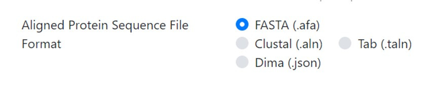
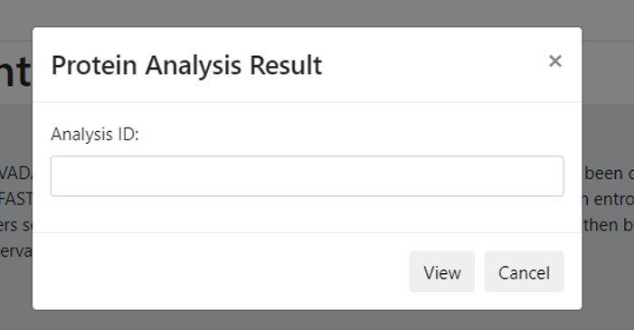
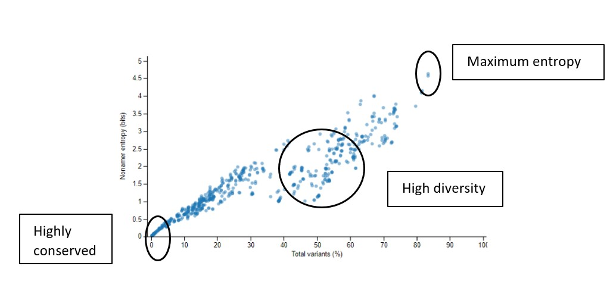
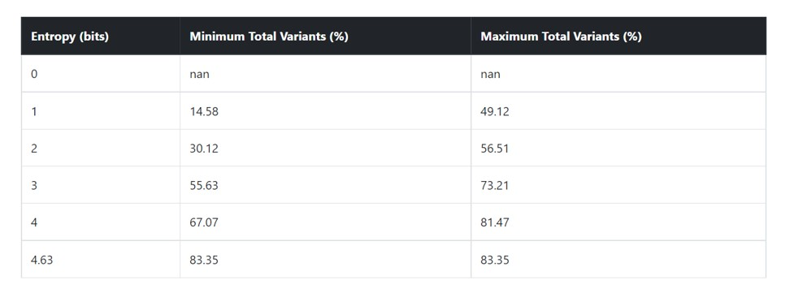

- {ref}`About<section-one>`
- {ref}`Browser compatibility<section-two>`
- {ref}`Workflow<section-three>`
- {ref}`Input file and parameters<section-four>`
- {ref}`How to interpret the results<section-five>`
- {ref}`FAQs<section-six>`
- {ref}`Support<section-seven>`


(section-one)=
# About

VADA is a web based viral diversity visualizer and interpreter. The input is a multiple sequence alignment (MSA) (.aln, .fas, .taln) file used for calculating Shannon’s entropy of each k-mer position or a JSON format file with entropy calculation. VADA classifies the k-mer sequences into diversity motifs viz. index and its major, minor and unique variants and presents the output as plots with an interpretation of the results.

(section-two)=
# Browser compatibility


## Accessibility
The user can access the web page [here](https://vada-devel.bioinfo.perdanauniversity.edu.my/). 

(section-three)=
# Workflow


(section-four)=
# Input file and parameters

- **Input file**

The input file is a multiple sequence alignment file of the protein to be analyzed. The user has to provide this file as input. It has to be in .aln , .fas or .taln format.
 
- **Parameters**
  - **Taxonomy ID**\
  Name your protein analysis (such as Nucleoprotein, Matrix protein, Polymerase protein etc.) 
  - **Low Support Threshold**\
  The minimum required sequence support is to not be called “Low support” for each k-mer position. These positions are analyzed and tagged in the result to not misguide scientific interpretations.

```{note}
The default value is **30**.
```

  - **Viral Protein Name**
  
The user has to fill in the name of the protein being analyzed because it will appear in the interpretation report obtained from VADA.


  - **Isolation Host Label**
  
The next field is the isolation host label. This is the source organisms from where the sequences being analyzed have been isolated. E.g Human, Avian.

 
  - **K-mer Length (sliding size of window)**
  
After that is the K-mer length. It is default set to **9**. The user can set his/her own desired length based on their experiment. 


  - **Select the Aligned Sequence File**
  
In this field the user is presented with a choice to either enter a pre-aligned file in the stated formats and has to click on the file type uploaded or s/he can upload a DIMA file in the JSON format. The difference between the two choices is that if the user has not calculated the Shannon’s entropy of the protein to determine the conserved motifs, then an aligned file is desired. In case the user has the entropy calculated file and only desires the graphic output and explanation, s/he can upload the JSON file.


A sample MSA input file is provided that can be downloaded and uploaded by clicking on the “Choose File” option.

The user should select the appropriate radio button for the format of the MSA or JSON file. In case of no selection, the results cannot be interpreted and presented correctly.


  - **Obtaining result notifications by email**
The last field is the email for intimation once the results are completed.


```{warning}
All parameters are required fields except the user email.
```
After all the information is entered, the user has to click "submit". A message highlighted in green background appears on top of fields with the analysis ID.


The user can use this ID to retrieve the results once email is received. The results can also be retrieved without the email by clicking the link “View Protein Analysis Result” on the top left corner of the page. 


Once clicked on the link, a pop-up window will appear.



The analysis ID is to be entered in the field and click “View”. The result page should appear with the graphs and table with their accompanying explanations. 

(section-five)=
# How to interpret the results

```{note}
The output is based on your input sequences. The results vary according to input multiple protein sequences analyzed and on the protein type being analyzed.
```

- **Result presentation**


```{note}
VADA provides five (5) graphs and one (1) table.
```


- **Graph 1**


This graph presents the overall diversity of the aligned nonamer sequences for which entropy calculation and classification of motifs is done of the submitted sequences of the user protein. The nonamer entropy (in bits) on the y-axis (left) is presented as the grey shaded area under the curve. The total variants (in %) is the orange line superimposed with the nonamer entropy is given on the y-axis on the right side of the graph.  The x-axis is the total nonamer positions analyzed.

The reference lines (orange and grey) at the top of the graph represent the maximum entropy calculated for HIV-1 Clade B envelope protein (Hu et al., 2013) which is the benchmark for entropy calculations and motif variants obtained. 


- **Graph 2**



This graph shows the scatter plot indicating how the nonamer entropy is related to the total variants obtained for the positions analyzed. If the nonamer is conserved it appears towards the base of the graph (near the beginning of the graph). In the case of high diversity, the entropy result appears more scattered as the total number of variants increases.

- **Graph 3**

```{image} images/graph3.jpg
:alt: graph3
:class: bg-primary
:width: 400px
:align: center
```
This graph demonstrates the relationship between motif distribution and increasing mutations. The decrease in conservation is represented by decline of index sequence incidences. This graph is divided into 3 sub graphs each representing the incidences of the classified motifs. Based on the k-mer position analyses, there can be an i) index motif, the most common motif across all nonamer positions, ii) major variant, which is the most common variant after the conserved index nonamer motif, iii) minor variant, that which occurs as the most frequent after the major variant and iv) unique variant, the least commonly occurring variant nonamer. 

- **Graph 4**

A simple violin plot of the frequency of distribution of the classified motifs. The width of the plot (x-axis) represents the frequency distribution of a given incidence of the indicated motif. The wider the plot, the higher the frequency. The yellow dot represents the median incidence value.


- **Graph 5**


This graph is a bar plot that illustrates the distribution of highly conserved nonamer sequence positions among the aligned sequences. It will appear as a single stacked bar. The legend is self-explanatory.

- **Tables**

Only one table is generated that gives the minimum and maximum of total variants at each entropy boundary value observed. 



(section-six)=
# FAQs

1. **Is there any copyright on the graphs?**\
No. But it is important to cite the website and our publications.

2. **How to cite?**\
The website
The publication

(section-seven)=
# Support
In case of any further queries, please email aaaa@pu.edu.my. 

